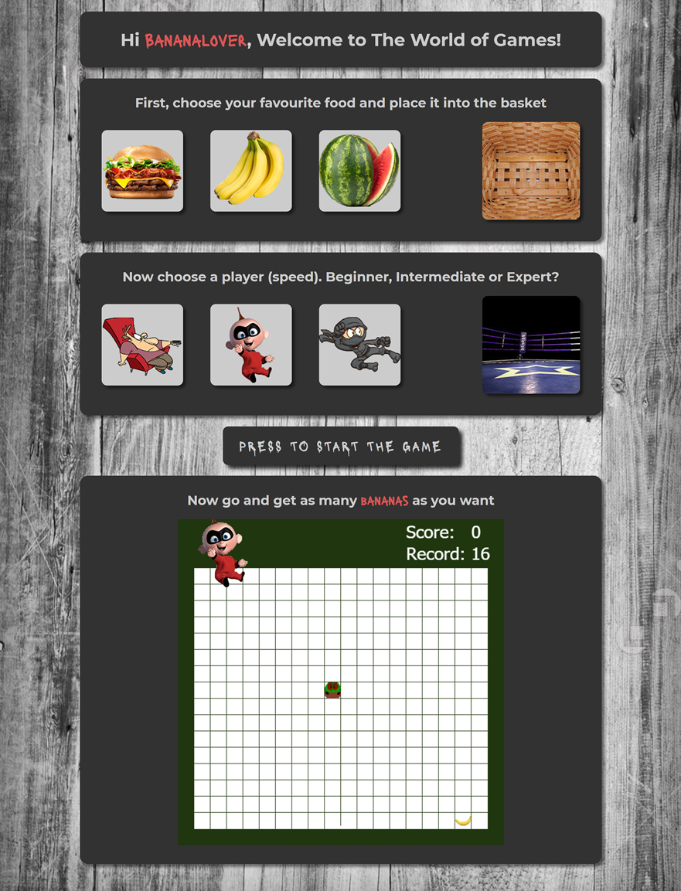

# Snake Game

[Link to Demo](http://portfolio.alexandrpasko.com)

The project is a single interactive web page where a user can choose a game settings and play the game. Drug and Drop features set the game elements and speed. Then a user can play the game which will save basic information such us a user preference, his score, and a record ever made in the game. The game is made by JavaScript and HTML5 Canvas. Design elements are made in Photoshop 

## Technologies/Languages:
* HTML
* CSS
* Canvas
* JavaScript
* Drag and Drop

## Screenshot:
